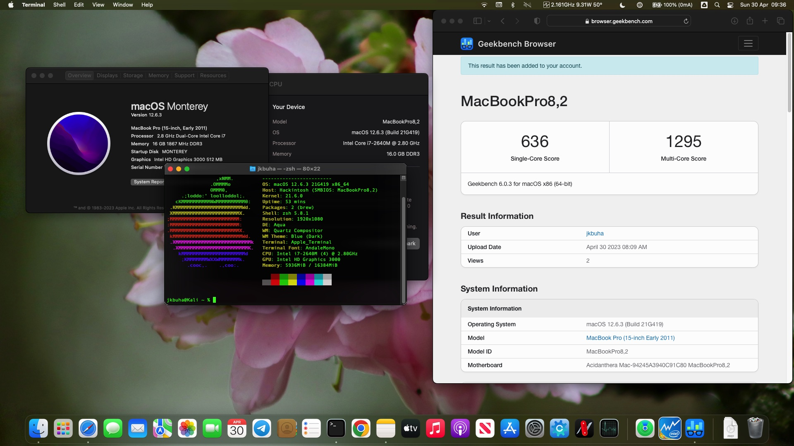

# Dell XPS 15z (L511z) Sandy Bridge macOS Monterey with OpenCore 1.0.1

# Details

| OpenCore Version | 1.0.1 |
| --- | --- |
| macOS Version | 12.7.6 (Monterey) |
| SMSBios | MacBookPro8,2 |

# Hardware Specifications

| Hardware | Specification | Status |
| --- | --- | --- |
| CPU | Intel Core i7-2640m | ✅ Working |
| BIOS | Dell A12 Custom Bios by jkbuha | ✅ Working |
| RAM | LDDR3 16GB | ✅ Working |
| Audio | Realtek ALC269 | ✅ Working |
| WiFi | Broadcom BRCM4360 | ✅ Working |
| Bluetooth | Broadcom BRCM4360 | ✅ Working |
| SSD | Crucial SATA 2TB | ✅ Working |
| Keyboard | British English | ✅ Working |
| Trackpad | Cypress v31 | ✅ Working |
| Webcam | UVC Camera VendorID_3141 ProductID_25642 | ✅ Working |
| SD Card | (unknown)  | 🔶 Disabled in Bios |
| S3 | Sleep/Wake | ✅ Working |
| GPU | Intel HD3000 512MB | ✅ Working |
| Display | 1920 x 1200 FHD LCD | ✅ Working |

# Overview

This is a great sturdy machine that was previously running Sierra (10.12) on Clover and has now been upgraded with a 2TB SATA 
and transitioned to Monterey. Given that the UEFI and ACPI specification on this machine was incomplete it was necessary to 
attach a fully working and modified DSDT together with some Monterey-specific tweaks. The only thing that doesn't seem to work 
is Continuity/Handoff, due to the BLE 5.0 minimum specification which the wireless adapter doesn't (yet?) support. Other than 
that it works perfectly, with idle temps of 45C and no fan noise throughout.

# BIOS Settings

Use custom bios by jkbuha (msg me for details)

| Setting | Option |
| --- | --- |
| SATA Operation | AHCI |
| Fast Strings | Enabled |
| UEFI Boot | Enabled |
| DVMT pre-alloc | 128MB |
| DVMT total | MAX |
| VT for Direct I/O | Disabled |

# Display EDID override
Some of the 15x (L502x) and 15z (L511z) machines experience display lock-up under macOS (the display freezes after 1 min 
of use and only the cursor moves) due to a framebuffer misalignment with the EDID settings. To overcome this it is necessary to 
force a display override with a specific EDID monitor file in /System/Library/Displays/Contents/Resources/Overrides - in my 
case it's DisplayVendor-6af but it will be specific to your LVDS vendor.

# Acknowledgements

A few thanks go out to people whose work has inspired me to dust off this machine and give it a new lease of life:

Mahesh Kondraju: https://github.com/maheshkondraju/Dell-XPS-17-L702X-Hackintosh-Open-Core-Bootloader/
Apollo: https://github.com/apollohackintosh/Dell-XPS-L502X-Catalina

# Want to help?

Send me any suggestions or queries to jkbuha@protonmail.com

Or else buy me a beer

Paypal (https://paypal.me/jkbuha) 

BTC: bc1qjuy6hy5shqqdnyzzcjlc2h4ua47gpugphuxdae

=)
